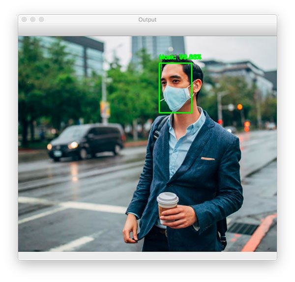
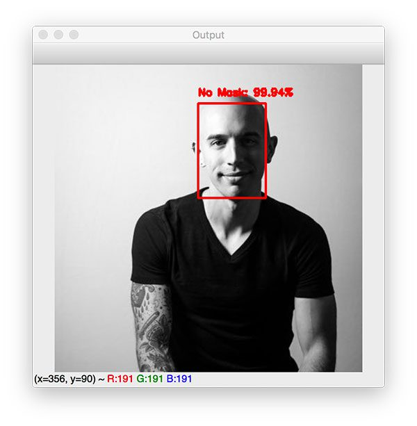
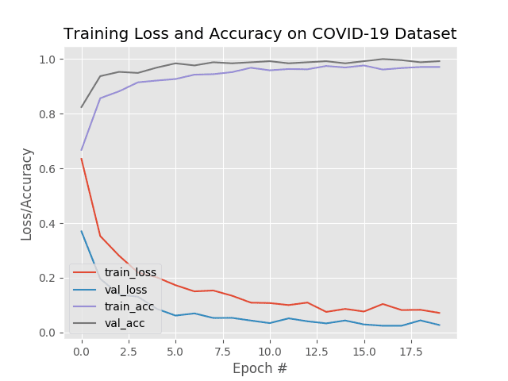

<h1> COVID-19: Face Mask Detector with OpenCV, Keras/TensorFlow, and Deep Learning </h1>

We’ll use this Python script to train a face mask detector and review the results.

<h2><b>Detect face masks in real-time video streams</b></h2>

<h2>Two-phase COVID-19 face mask detector </h2>

In order to train a custom face mask detector, we need to break our project into two distinct phases, each with its own respective sub-steps 

<b>1. Training: </b>Here we’ll focus on loading our face mask detection dataset from disk, training a model (using Keras/TensorFlow) on this dataset, and then serializing the face mask detector to disk.  
<b>2. Deployment:</b> Once the face mask detector is trained, we can then move on to loading the mask detector, performing face detection, and then classifying each face as with_mask or without_mask

Our current method of detecting whether a person is wearing a mask or not is a two-step process:

<b>Step #1:</b> Perform face detection  
<b>Step #2:</b> Apply our face mask detector to each face  

To circumvent that issue, you should train a two-class object detector that consists of a with_mask class and without_mask class.

Combining an object detector with a dedicated with_mask class will allow improvement of the model in two respects.

First, the object detector will be able to naturally detect people wearing masks that otherwise would have been impossible for the face detector to detect due to too much of the face being obscured.

Secondly, this approach reduces our computer vision pipeline to a single step — rather than applying face detection and then our face mask detector model, all we need to do is apply the object detector to give us bounding boxes for people both with_mask and without_mask in a single forward pass of the network.

