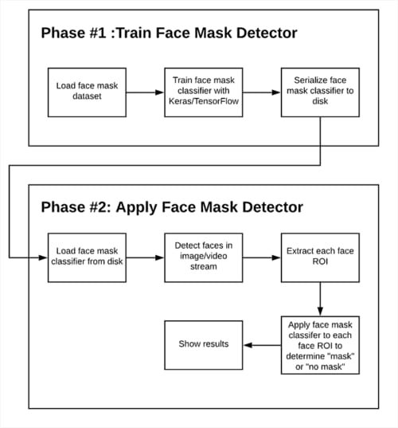
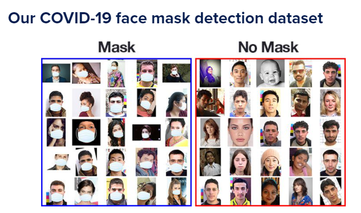

<h1> COVID-19: Face Mask Detector with OpenCV, Keras/TensorFlow, and Deep Learning </h1>

We’ll use this Python script to train a face mask detector and review the results.

<h2><b>Detect face masks in real-time video streams</b></h2>

<h2>Two-phase COVID-19 face mask detector </h2>

In order to train a custom face mask detector, we need to break our project into two distinct phases, each with its own respective sub-steps 

<b>1. Training: </b>Here we’ll focus on loading our face mask detection dataset from disk, training a model (using Keras/TensorFlow) on this dataset, and then serializing the face mask detector to disk.  
<b>2. Deployment:</b> Once the face mask detector is trained, we can then move on to loading the mask detector, performing face detection, and then classifying each face as with_mask or without_mask

